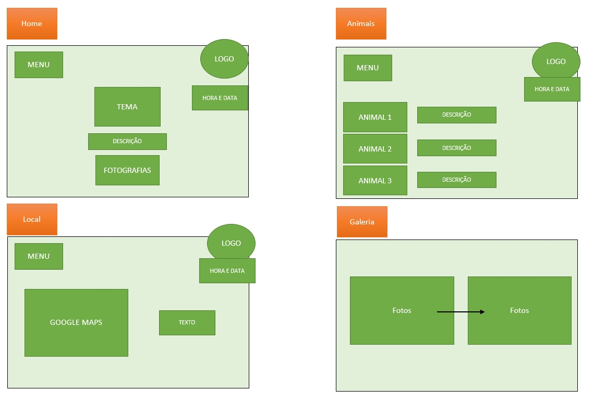
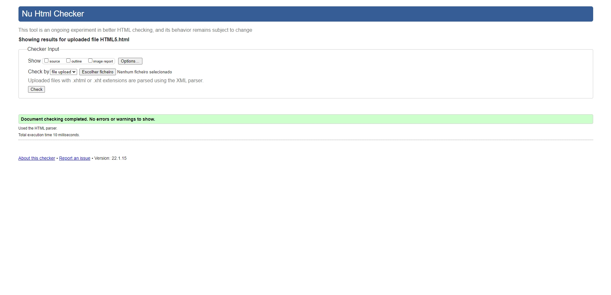
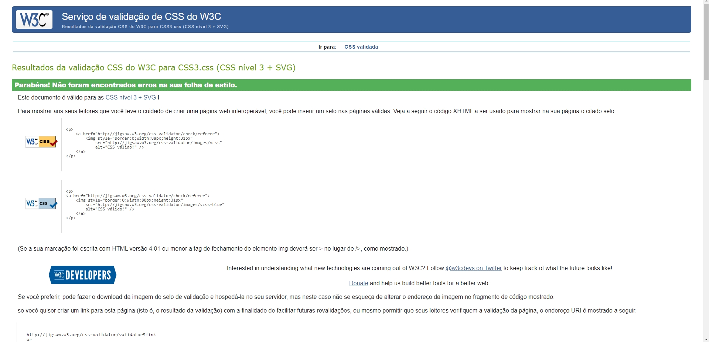

# **Project Presentation - Apresentação do projeto**
Foi proposto o desenvolvimento de uma página web para o trabalho final de 
Tecnologias Web, aplicando os conhecimentos adquiridos na unidade curricular, bem como, pesquisas e auto-aprendizagem.
A temática escolhida pelo docente foi “Florestas” e dentro desse tema, decidimos 
escolher o sub-tema “Os animais mais perigosos da Amazónia” e toda a informação relevante à volta do mesmo. 
Pretendemos começar com uma introdução ao local (Floresta Amazónica) com 
imagens acompanhadas de texto que vão desaparecendo à medida que fazemos scroll. 
Durante o texto de apresentação do animal, este é acompanhado com um background do 
mesmo e assim sucessivamente. Há uma troca de background sempre que o animal muda. 
No final de cada texto estará presente uma hiperligação que direciona o utilizador para a Wikipédia do respetivo animal, para mais detalhes.
Temos a ideia de fazer um slide com fotografias e videos do espaço e dos animais 
referidos acima. 
Pretendemos criar ainda um menu interativo com as categorias dos animais de acordo 
com as suas características (terrestre, aquático, répteis, etc), uma música de fundo e alguns detalhes como a data, hora e a localização da Floresta Amazónica no google maps. No final da página, pretendemos colocar as redes sociais e contactos.

No entanto, nem tudo o que tinhamos em mente foi concretizado.
Como tal, decidimos tornar o website de caráter informativo principalmente sobre a Floresta Amazónica e dentro do mesmo, fazer referência aos Animais Mais Perigosos da Amazónia numa das páginas criadas. Nos restantes aspectos, a maioria dos elementos pensados para a criação do website, foram feitos, tais como: 
- Introdução ao local (Floresta Amazónica)
- Apresentação dos Animais mais Perigosos da Amazónia
- Ligação dos animais à Wikipédia
- Data e hora em constante atualização
- Localização da Floresta Amazónica (Google Maps) 
Acrescesntamos também um formulário na última página.

# **2. User Interface – Interface com o utilizador**

## _Sitemap_:

## _Sketch_ :

# **3. Product - Produto**

## **_-Descrição_**:
É um Website informativo e documental sobre a Floresta Amazónica e os Animais mais Perigosos que lá vivem.

## **_-Regras de Utilização_**:
Não é necessário qualquer tipo de registo do utilizador.

## **_-Ajuda à Navegação_**:
O website é bastante simples e bastante intuitivo. Com o menu no canto superior esquerdo, torna-se mais fácil de navegar entre as 5 páginas. 
Na página inicial é nos apresentado o título do site e, por sua vez, o tema do mesmo juntamente com uma breve descrição da Floresta Amazónica. É também nos apresentado um vídeo ilucidativco acerca da temática em questão.
Na página seguinte, é nos dada a localização exata da Floresta e dos países abragentes, através de uma tabela com as percentagens de ocupação da floresta em cada um deles. É também apresentado, mais à direita, um mapa proveniente do _Google Maps_, sendo este interativo.
Na terceira página, destina-se aos animais pertencentes à floresta, classificados pela sua ameaça, através de uma lista, bem como, a descrição e imagem de cada um deles.
Na quarta página, é nos presenteada uma galeria de fotografias da Floresta Amazónica nos seus diversos estados climatéricos, desde chuva, ao nascer do sol, passando pelos seus animais e paisagens.
Por fim, na quinta e última página destina-se ao formulário, onde o utilizador poderá nos dar a sua opinião ou sugestão de melhoramento do website.

## **-_Validações_**:

Todas as validações foram feitas na plataforma de validação W3C.

## **-_Detalhes de Implementação_**:

Foram realizados todos os objetivos pedidos pelo Docente. Eram requeridas 4 páginas estáticas mas nós implementamos 5 páginas. 
Implementamos também alguns elementos para tornar o site mais interativo, tais como: 
- Data e Hora
- Slide de Fotografias
- Vídeo
- Mapa (_Google Maps_)

